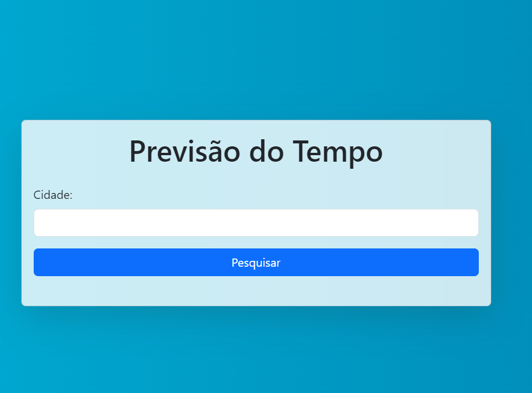
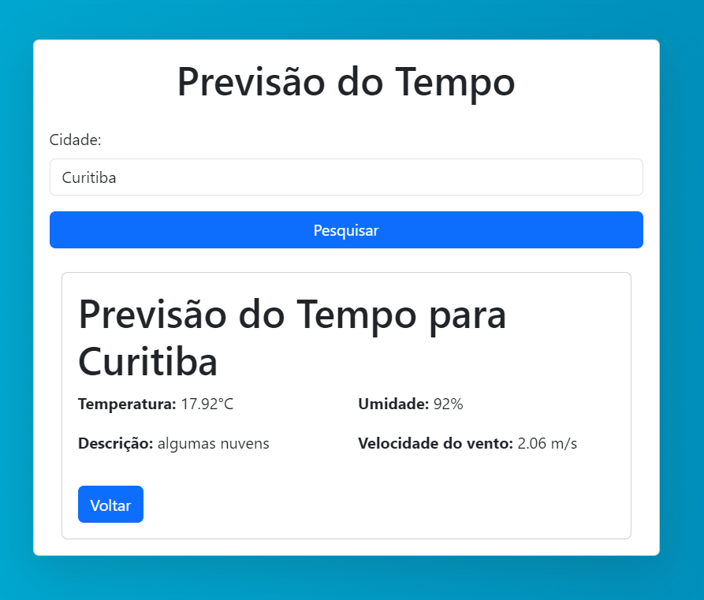

# Previsão do Tempo
=====================

## Índice
--------

* [Introdução](#introdução)
* [Funcionalidades](#funcionalidades)
* [Imagens](#imagens)
* [Instalação](#instalação)
* [Uso](#uso)
* [Créditos](#créditos)

## Introdução
------------

Este é um projeto de previsão do tempo que utiliza a API do OpenWeatherMap para fornecer informações climáticas atuais.

## Funcionalidades
----------------

* Exibe a previsão do tempo atual para uma cidade específica digitada.
* Permite a busca por cidades
* Exibe informações climáticas detalhadas, incluindo temperatura, umidade e velocidade do vento

## Imagens
---------

### Tela Inicial

### Tela de Previsão do Tempo

## Instalação
------------

1. Clone o repositório: `git clone https://github.com/inovaja/previsao_tempo`
2. Instale as dependências: `pip install -r requirements.txt`
3. Crie uma conta e sua chave no site `https://openweathermap.org/`
4. Configure a API_KEY no arquivo `main.py`

## Uso
-----

1. Execute o aplicativo: `uvicorn main:app`
2. Acesse o aplicativo em `http://localhost:8000`

## Créditos
---------

* Desenvolvido por [Alison Sassi](https://github.com/alisonsassi95)
* Utiliza a API do OpenWeatherMap